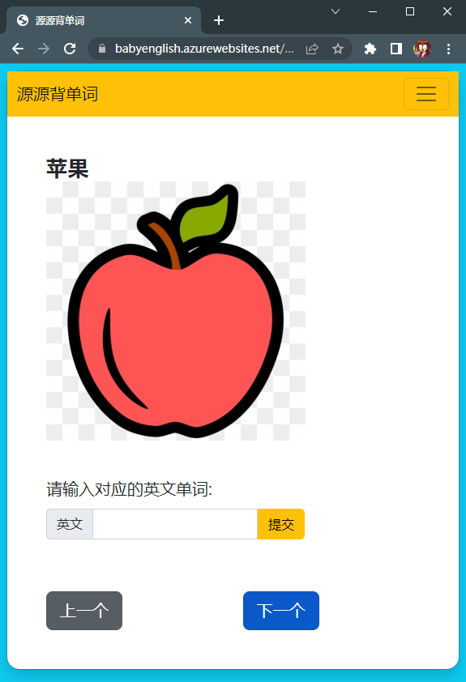

# babyenglish
#### My very first web app made by Django & Bootstrap!
#### Deployed to Azure App Service, with Whitenose lib to serve Django static files.

# Notes for Deployment:
1. Create a Azure App Service and connect to Github Actions.  
2. Before pushing to github, run `python manage.py collectstatic` for Whitenose to serve static files. (uploaded media files are configured with a /static url prefix, thus get treated as static files)  

